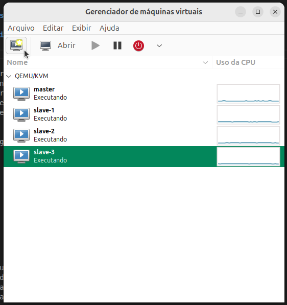
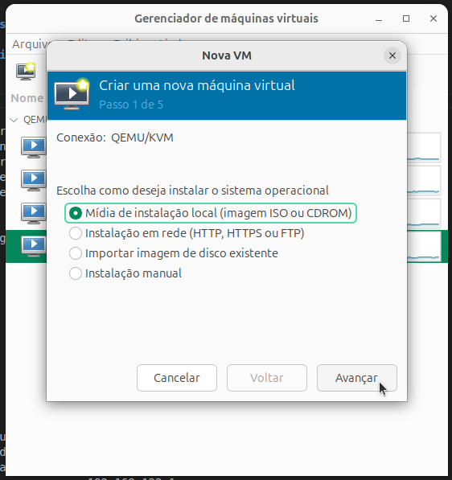
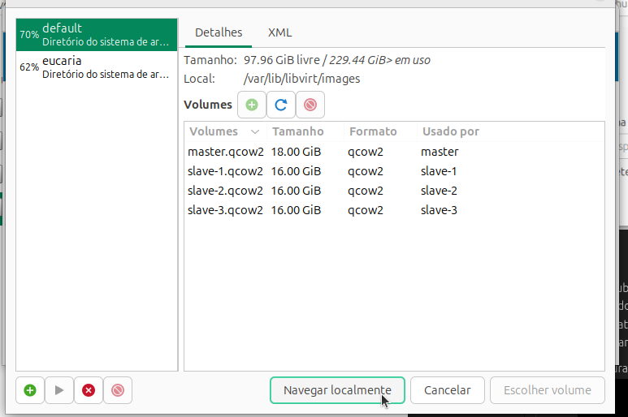
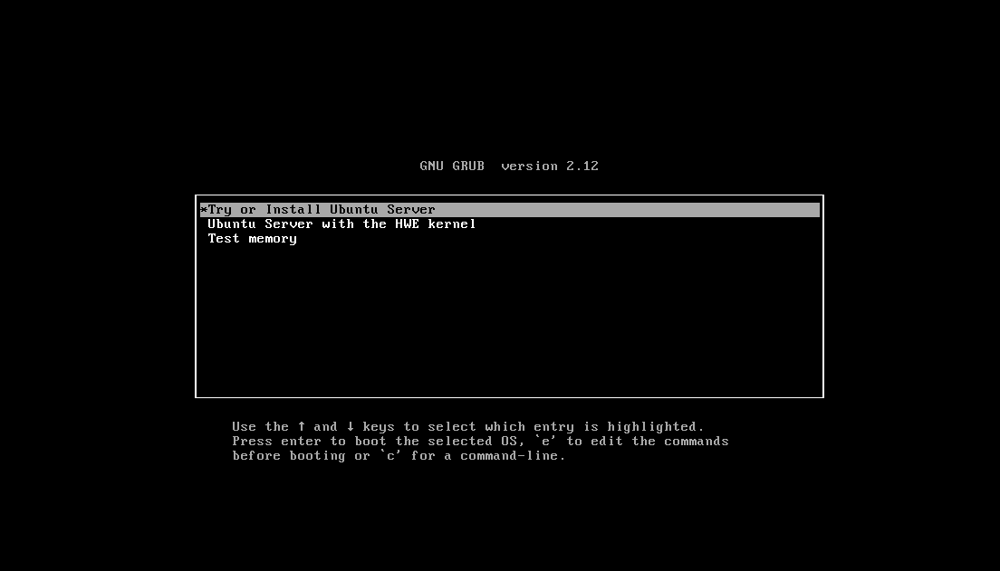
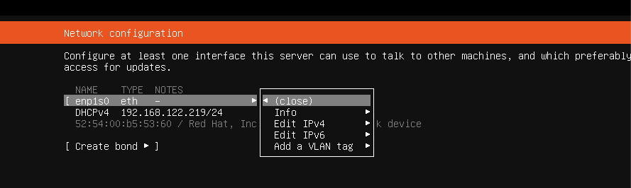
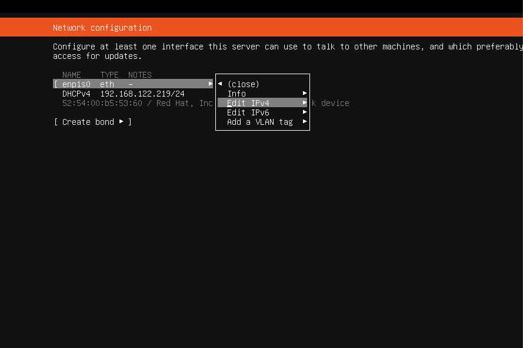
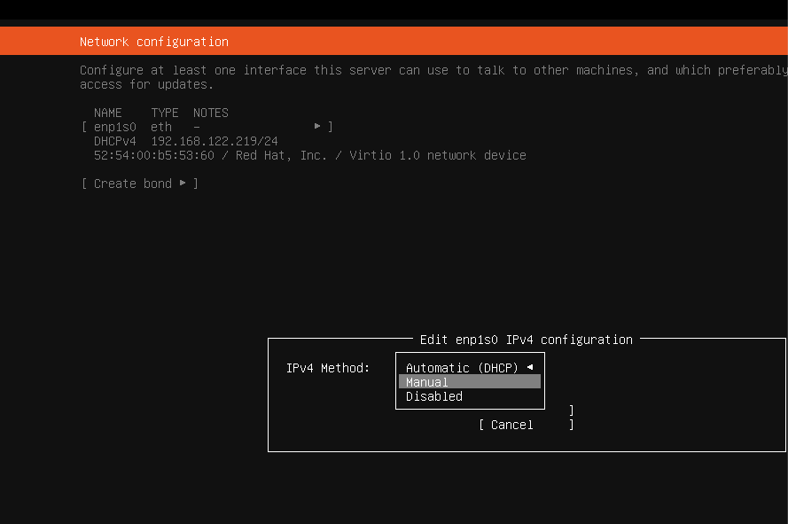
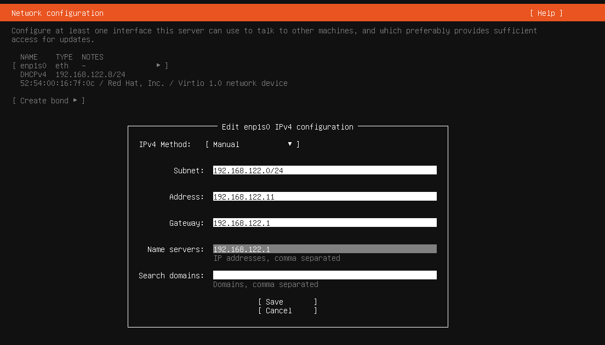

# Virtualização

Para construir o cluster que abrigartá o serviço do Hadoop foram criados 4 VMs com o qemu/libvirt/virt-manager.

- master
- slave-1
- slave-2
- slave-3

## Instalação

Baixa o virt-manager ele vai baixar o virt por baixo e demais modulos. Dê acesso ao seu usuario ao grupo libvirt e kvm. Verifique se o computador suporta virtualizacao, se tiver desativado ative na BIOS. Baixe a iso  do ubuntu server. 

## Criando as VMs






Siga as etapas definindo os recursos para VM, neste trabalho foi definidos os recursos conforme a tabela a seguir:

Apos definidi, irá concluir e logo apos comecara a instalacao do ubuntu server na vm. 


No geral pode serguir o padrao, mas algumas etapas importantes foram ajustadas, entre elas configuracao de rede, perfil e instalacao de ssh.

### 1. Configuracao de rede
Configuramos manualmente seguindo os critérios:

master
- Subnet: 192.168.122.0/24
- Address: 192.168.122.10 (Este é o IP do seu master)
- Gateway: 192.168.122.1
- Name servers: 192.168.122.1

slave-1
- Subnet: 192.168.122.0/24
- Address: 192.168.122.11
- Gateway: 192.168.122.1
- Name servers: 192.168.122.1

slave-2
- Subnet: 192.168.122.0/24
- Address: 192.168.122.12
- Gateway: 192.168.122.1
- Name servers: 192.168.122.1

slave-3
- Subnet: 192.168.122.0/24
- Address: 192.168.122.13
- Gateway: 192.168.122.1
- Name servers: 192.168.122.1







### 2. Configuracao de perfil


## Ajuste de SSH entre os clusters

Para acessar as máquinas no terminal proprio (host) e o master acessar os slaves foram feitas algumas confoguracaoes. Primeiro de um ping de um para outro para testae

## Copiando chaves publicas

Foram copiadas as chaves publicas do host no master e slaves e copiado as chaves do master nele mesmo e nos slaves.

2. Verificando a chave: ls ~/.ssh/id_*.pub
2. Gere a chave, se na tiver: ssh-keygen -t rsa
3. Copiando chave do host:
    - ssh-copy-id hadoop@192.168.122.10
    - ssh-copy-id hadoop@192.168.122.11
    - ssh-copy-id hadoop@192.168.122.12
    - ssh-copy-id hadoop@192.168.122.13
  
faca o mesmo para master.

## 

Edite o arquivo `sudo nano /etc/hosts` em TODAS AS 5 MÁQUINAS (as 4 VMs + o seu computador eucaria) e garanta que todas elas tenham este bloco de texto no final:

``` bash
127.0.0.1 localhost
# 127.0.1.1 master <---- lembre-se de comentar nas VMs para nao confundir o hadoop

...

# Cluster Hadoop VMs
192.168.122.1 host
192.168.122.10 master
192.168.122.11 slave-1
192.168.122.12 slave-2
192.168.122.13 slave-3

```

Agora é possivel acessar as VMs apenas pelo apelido, seu passar o ip e sem senha, tanto do host quanto no master.

- ssh hadoop@master
- ssh hadoop@slave-1
- ssh hadoop@slave-2
- ssh hadoop@slave-3